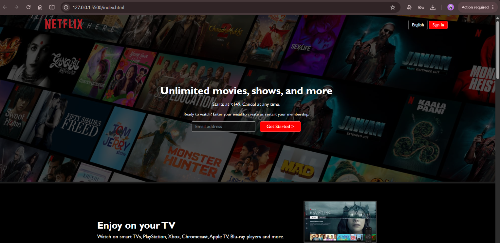
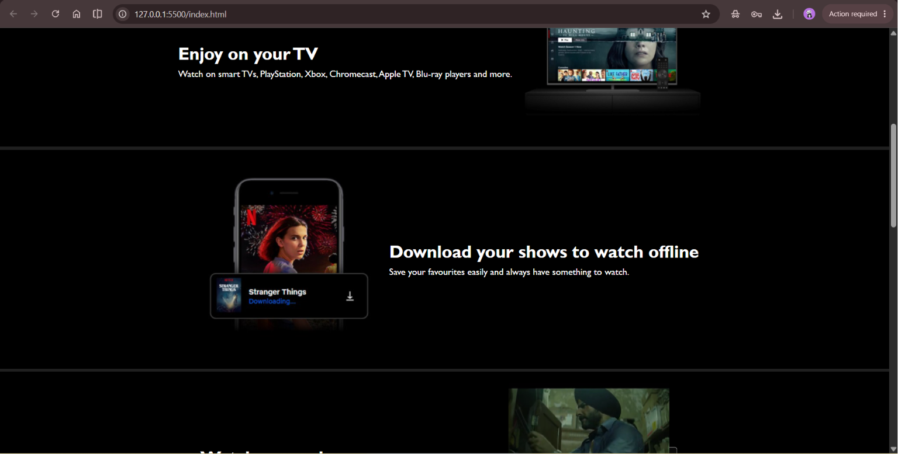
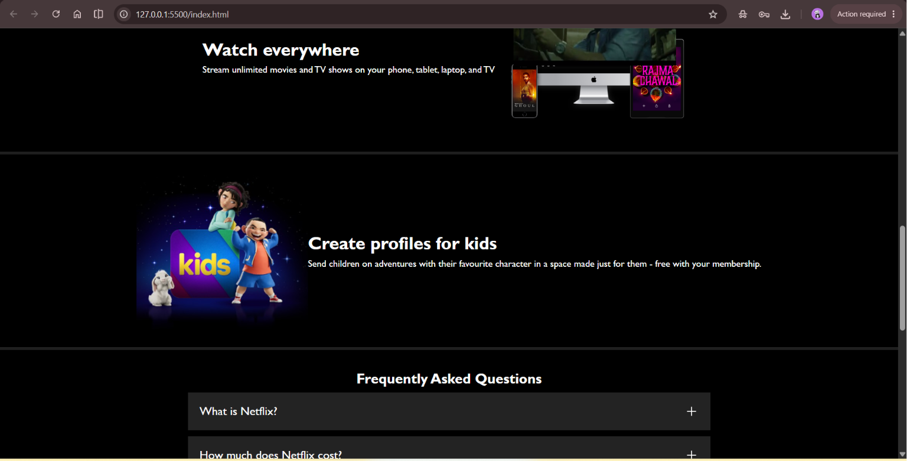
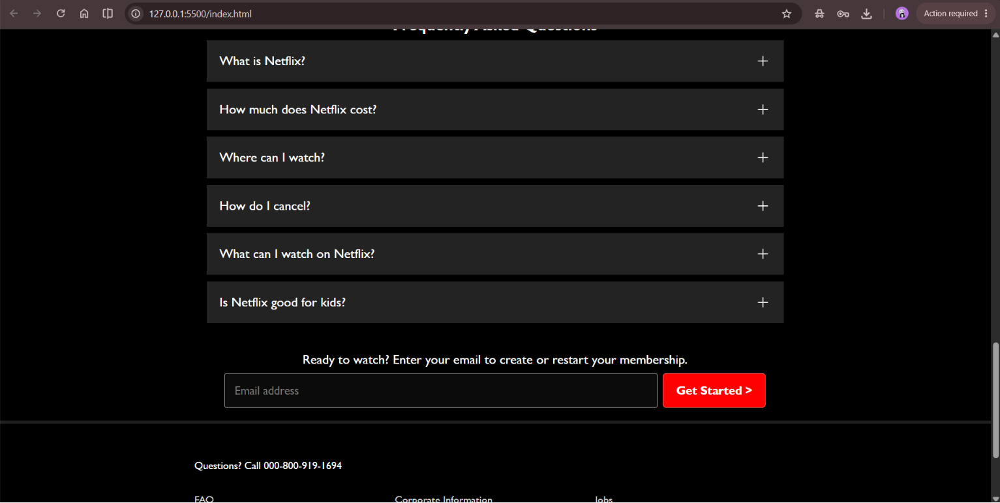
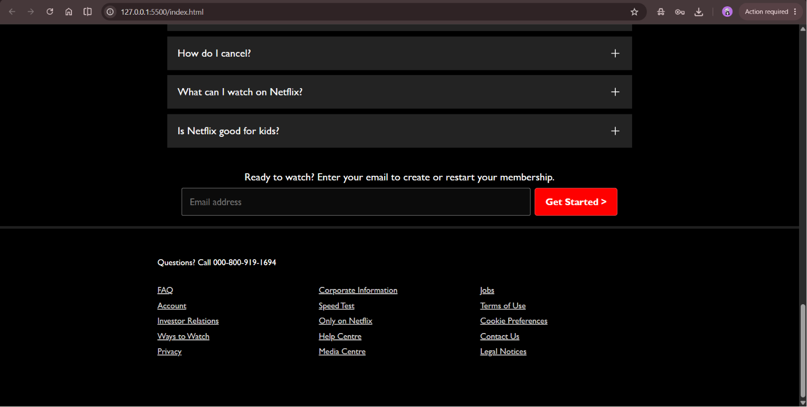

# 🎬 Netflix Clone

A responsive Netflix landing page clone built using **HTML5** and **CSS3**. This project recreates the look and feel of the Netflix homepage while practicing responsive web design and frontend development.

## 🚀 Live Demo

🔗 https://nithyakonudula.github.io/netflix-clone/

## 📂 Repository

🔗 https://github.com/nithyakonudula/netflix-clone

## ✨ Features

- Responsive Netflix-inspired UI
- Navigation Bar
- Hero Section
- TV, Mobile, Kids, and Everywhere sections
- FAQ Section
- Footer
- Modern and clean design

## 🛠️ Technologies Used

- HTML5
- CSS3

## 📸 Screenshots

### Homepage



### Features





### FAQ





## 📁 Project Structure

```text
netflix-clone/
│── assets/
│── screenshots/
│   ├── homepage.png
│   ├── features1.png
│   ├── features2.png
│   ├── faq1.png
│   └── faq2.png
│── index.html
│── style.css
└── README.md
```

## 🎯 Learning Outcomes

- Semantic HTML5
- CSS3 Styling
- Flexbox
- Responsive Design
- Landing Page Development
- UI Cloning

## ⚠️ Disclaimer

This project was created for educational purposes only. It is a frontend UI clone inspired by Netflix and is not affiliated with or endorsed by Netflix.

## 👩‍💻 Author

**Nithya Konudula**

GitHub: https://github.com/nithyakonudula

---

⭐ If you like this project, consider giving it a star!